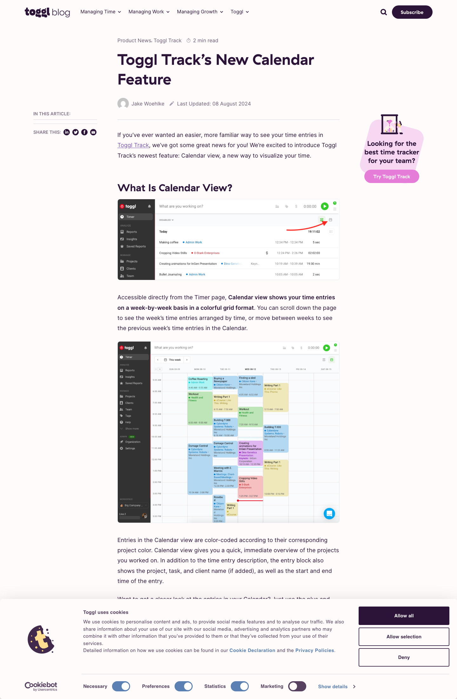
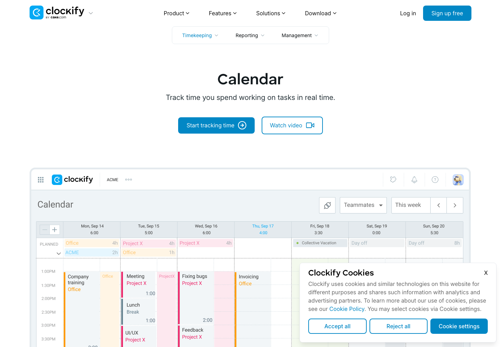
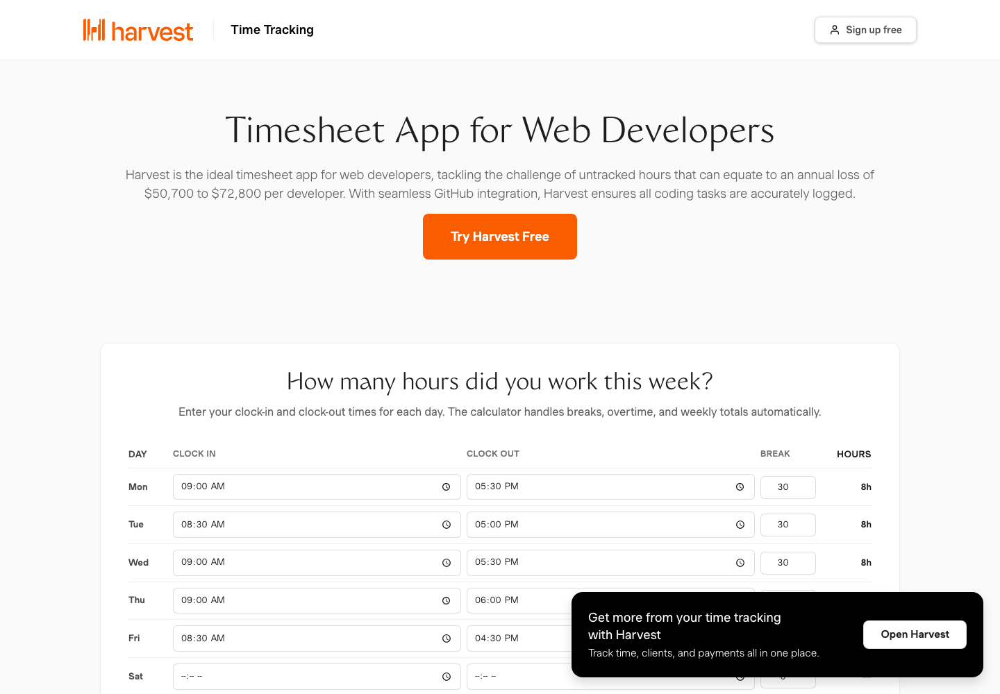
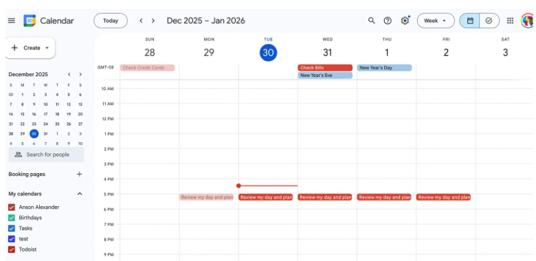
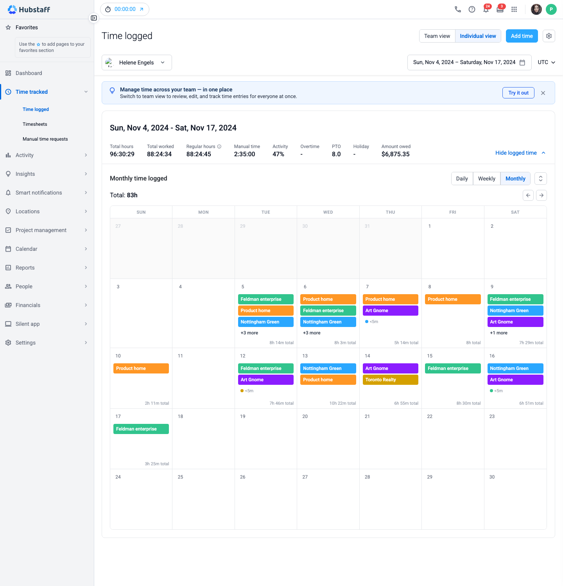
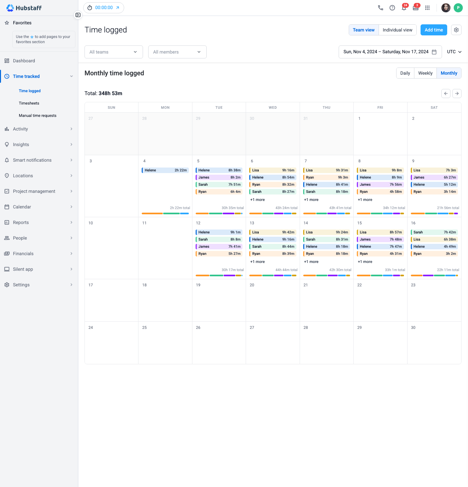

# Calendar Views Research — Day / Week / Month / Aggregated

**Project:** Time Logged — Monthly calendar view · **Date:** 2026-07-07
**Screenshots:** [research/screenshots/](screenshots/) — competitor images from each product's own public pages; Time Logged images from the running [time-logged-v.2](../time-logged-v.2/index.html) prototype. All captured 2026-07-07.

## TL;DR

**None of Toggl, Clockify, or Harvest has a true month-grid calendar view.** All three stop at Day/Week, and push month-level data into a separate Reports section as tables or charts — never a calendar grid. Clockify's own community explicitly asked for a monthly calendar timesheet and was told to use custom-range reports instead.

**So Time Logged's Monthly view is a differentiator, not a parity feature.** There's no competitor pattern to copy for day-cell overflow or aggregation. Google Calendar is the right structural reference for month-grid *mechanics* (already our model), but its per-cell data (discrete events) is the opposite of ours (aggregated durations) — which is why the "aggregated" team view is genuinely novel work, already prototyped in [time-logged-v.2](../time-logged-v.2/index.html).

| Product | Day | Week | Month | Aggregated view |
|---|---|---|---|---|
| **Toggl Track** | Time-grid blocks | Time-grid, 7 cols, "5-day" variant | ❌ none | Reports: bar+pie chart, Workload table, Utilization % heatmap |
| **Clockify** | Time-grid, zoomable | Time-grid, planned-vs-actual overlay | ❌ confirmed gap | Reports: bar chart, weekly grid, dashboard |
| **Harvest** | Timer + manual entry | Project-rows × day-cols grid | ❌ "Calendar" is week-scoped | Time Report: 4 tabs, bar charts |
| **Google Calendar** | 24h grid, "now" line | Same grid × 7, today highlighted | ✅ 6×7 grid, 3–5 chips + "+N more" | N/A — individual events, not durations |
| **Time Logged (v2)** | — | ✅ weekly grid | ✅ Google-Calendar-style (individual) | ✅ member pills + project bar (team) |

---

## 1. Toggl Track

- **Day/Week**: colored blocks on an hour-axis time-grid (not a list); Week is the default, with a weekends-hidden "5-day" variant.
- **Month: doesn't exist.** Confirmed via Toggl's own docs — Calendar caps at ~3 months of *scrollable* range, never a monthly grid. Users are redirected to Reports for month-level data.
- **Aggregated view**: Reports → Summary (bar+pie chart), Workload (plain hour-total grid), and a Premium Utilization report with %-based color coding (yellow 71–79%, red <70%) — the only heatmap-like pattern anywhere in Toggl.
- Notable: drag-to-create/resize, activity-detection overlay ("Timeline"), external calendar overlay.

*Toggl's own blog, [Calendar View feature announcement](https://toggl.com/blog/calendar-view-feature) — the week grid is as far as it goes.*

---

## 2. Clockify

- Time functions are split across separate sections (Tracker / Timesheet / Calendar / Reports) rather than one view-switcher.
- **Day/Week (Calendar)**: hour-axis time-grid, zoomable to 5-min granularity, blue "now" line, Google/Outlook planned-vs-actual overlay. Overlapping entries just render on top of each other — no collision handling.
- **Month: confirmed, self-acknowledged gap.** A Clockify Community thread explicitly requested a monthly calendar timesheet; support pointed to custom-range Reports instead, with no plan to build one.
- **Aggregated view**: Weekly report (project-rows × day-cols grid), Summary report (bar chart + grouped table), Dashboard (chart + tables). No calendar-heatmap anywhere.
- Notable: no "+N more" overflow pattern exists in Clockify at all — its absolute-positioned blocks allow overlap instead of needing truncation, which is exactly the problem a month grid's fixed-height cells have to solve and Clockify never had to.

*Source: [clockify.me/features/calendar](https://clockify.me/features/calendar)*

---

## 3. Harvest

- **Day**: timer + manual entry, notes-enabled. **Week**: project-rows × day-columns grid, built for bulk entry (no timer/notes there).
- **Month: doesn't exist.** Harvest limits itself to Day/Week "to keep things uncluttered." A newer "Calendar view" exists but is week-scoped (drag/resize, syncs external events) — not a month grid.
- **Aggregated view**: Time Report (4 tabs: Clients/Projects/Tasks/Team, bar charts), Project Analysis (budget-burn line chart). Purely tabular/chart — no calendar-grid or heatmap.
- Their real app screenshots sit behind Cloudflare bot-protection that blocked automated capture, so findings above are text-sourced from their help docs, not visually verified here.

*Source: [getharvest.com/time-tracking](https://www.getharvest.com/time-tracking/timesheet-app-for-web-developers) — included as a brand/style reference only.*

---

## 4. Google Calendar (structural reference only)

Doesn't track time — included purely as the UX benchmark for month-grid *mechanics* (our prototype's CSS literally says "Google Calendar month style").

- **Month view**: fixed 6×7 grid (leading/trailing days dimmed but clickable), today gets a filled blue circle, each cell shows ~3–5 event chips before a **"+N more"** link, clicking an event or the overflow opens a **popover** (never navigates).
- **The gap we can't borrow past**: Google's month view is an individual-event list per cell — it has no concept of a duration total, it just truncates the literal list. Our unit of value is the opposite (aggregated hours), so we can reuse the *visual* language (chips, overflow link, popover-not-navigate, dimmed/today states) but had to design the *data model* (pills, project bar) ourselves.

*Source: [AnsonAlex.com Google Calendar tutorial](https://ansonalex.com/tutorials/google-calendar-tutorial/) — a Month-view screenshot wasn't available from a public, unauthenticated source, but the same today/now/color-coding conventions carry over.*

---

## 5. Our current design — Time Logged v2

[time-logged-v.2](../time-logged-v.2/index.html) already has a working Month view in two modes:

**Individual** — Google-Calendar-style chips (project color + name), short-entry dots for sub-5-min entries, "+N more" overflow, day total, click-to-popover with full entry list + "jump to day" action.

**Team/aggregated** — member pills (name + hours, sorted desc, "+N more" overflow), a per-day segmented **project-distribution bar** (hover for breakdown), hover-per-pill for that member's own project split.

⚠️ **Heat-map density mode is designed but not wired up.** The CSS (`.ts-cal-day--heat`) and tooltip JS exist, but `renderGridMulti()` never emits that markup — it's currently unreachable dead code, not a working large-team fallback, despite the CSS comment describing it for 31+ member orgs.

---

## 6. Final solution & why it's the best approach

**The solution:** two modes, one visual grammar — Individual (chips + popover, Google Calendar's grammar) and Team (pills + project bar, our own design for the aggregation problem Google never had to solve).

Why this beats the alternatives:

1. **Fills a real gap, not parity** — no competitor solved month-level aggregation, so this is where the differentiation actually is.
2. **Reuses a zero-learning-curve pattern where it fits** — everyone already knows "chip = item, dimmed = out of month, blue = today, click = popover," so Individual mode costs nothing to learn.
3. **Solves what Google Calendar's model can't** — a duration rollup, not an event list — which is why Team mode had to be designed rather than copied.
4. **Progressive disclosure bounds cell height at any team size** — capping visible pills + "+N more" avoids the vertical blow-up a naive per-member-row table (Harvest/Clockify-style, stretched to a month) would cause.
5. **The project bar answers "what did we work on" at a glance** — competitors all force a click into a separate Report for that; ours surfaces it on hover, inside the calendar.
6. **Shared grid chrome between modes** makes Individual↔Team feel like a filter change, not a different tool — relevant since v2 already nudges users from Individual → Team via an upsell banner.

**Deliberately not:** heat-map-first (hides *who*/*what* behind color until hover — worse default for common team sizes) or a plain data table (optimizes for exact numbers, not at-a-glance shape — that's what Reports is for).

## 7. Gaps & recommendations

1. **Heat-map mode isn't implemented** — CSS/tooltip JS exist, but nothing renders it. Validate the real team-size threshold before building; the "31+, demoed at 5+" figure looks like a placeholder.
2. **No external pattern exists to validate the pill/bar design against** — since we designed it ourselves, test it with users rather than assuming it's "how everyone does it."
3. **Consider a Toggl-style utilization % color lens** as a second aggregation mode, distinct from raw-hours — flags under/over-tracking, which nothing in v2 currently does.

---

## Sources

**Toggl:** [Calendar view](https://support.toggl.com/en/articles/3924052-tracking-time-in-the-calendar-view) · [Summary Report](https://support.toggl.com/en/articles/2216727-summary-report) · [Workload Report](https://support.toggl.com/en/articles/2212668-weekly-report)
**Clockify:** [Calendar](https://clockify.me/help/track-time-and-expenses/calendar-view) · [Weekly report](https://clockify.me/help/reports/weekly-report) · [Monthly timesheet request thread](https://forum.clockify.me/t/monthly-timesheet/3310)
**Harvest:** [Day view](https://support.getharvest.com/hc/en-us/articles/360048181892-Tracking-time-Day-view) · [Week view](https://support.getharvest.com/hc/en-us/articles/360048687531-Tracking-and-editing-time-Week-view) · [Time report](https://support.getharvest.com/hc/en-us/articles/360048181692-Time-report)
**Google:** [View day/week/month](https://support.google.com/calendar/answer/6110849) · [Keyboard shortcuts](https://support.google.com/calendar/answer/37034)
**Internal:** [time-logged-v.2/index.html](../time-logged-v.2/index.html) · [calendar-view.css](../time-logged-v.2/assets/calendar-view.css)
